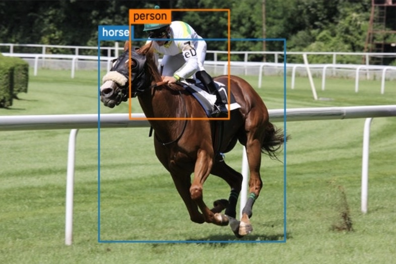
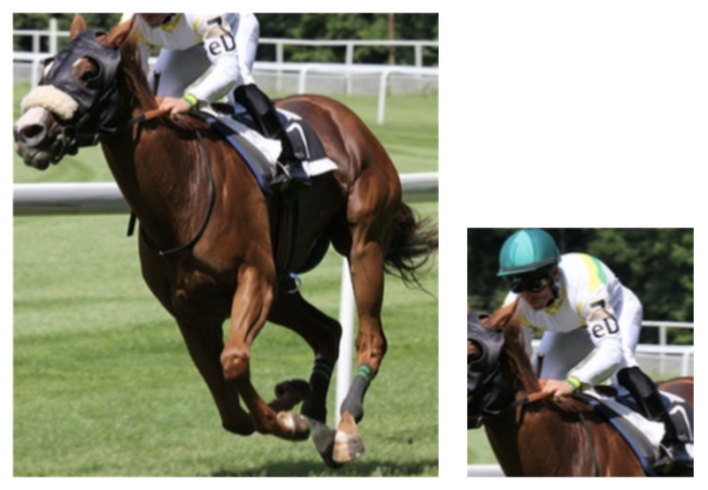
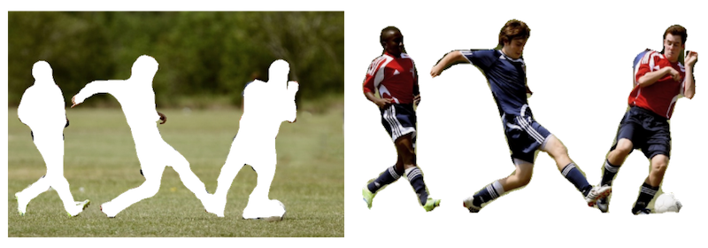
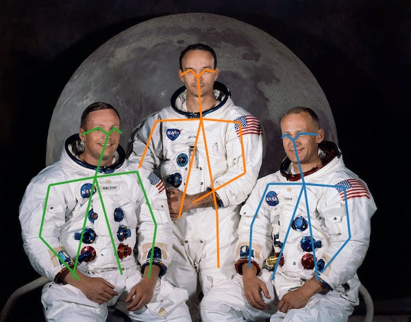

# max-vis

`max-vis` is a JavaScript utility to help render the predictions returned by some of the deep learning models of the [Model Asset eXchange (MAX)](https://ibm.biz/max-models) onto its corresponding image.

Given the source image and the JSON prediction from one of the MAX image model, `max-vis` can go ahead and render a new version of the image with predictions (i.e., bounding box, pose lines, etc) annotated on it.

## Install

- browser

   ```javascript
   <script src="https://cdn.jsdelivr.net/npm/@codait/max-vis"></script>
   ```

- Node.js

   ```
   npm install --save @codait/max-vis canvas
   ```
   > **Note**: _When installed in a Node.js environment, the `canvas` Node.js package is a required dependency._

## Usage

See working examples for browser and Node.js environments in the [`/demos`](https://github.com/CODAIT/max-vis/tree/master/demos) directory.

- browser

   ```javascript
   const maxPred = ... // 'maxPred' is prediction JSON object returned by a MAX model

   const myImage = document.getElementById('myimage')

   // return a new image annotated with prediction results
   maxVis.annotate(maxPred, myImage)
      .then(annotatedImage => {
         // return a new image annotated with prediction results
         // the returned response is a Blob
         let img = document.createElement('img')
         img.src = URL.createObjectURL(annotatedImage)
         document.body.appendChild(img)
      })
   ```

   > **Note**: _When loaded in a browser, the global variable `maxVis` will be available to access the API._

- Node.js

   ```javascript
   const myImage = 'images/myImage.jpg'
   // 'pred' is prediction JSON object returned by a MAX model
   maxVis.annotate(pred, myImage)
      .then(annotatedImage => {
         // returns 'annotatedImage' as a Buffer
         fs.writeFile('myAnnotatedImage.jpg', annotedImage, (err) => {
            if (err) {
               console.error(err)
            }
         })
      })
   ```
   
## API

### overlay(_prediction_, _image_, _options_)  

Processes the prediction against the image and renders the prediction (in a `Canvas` overlay) on top of the image. Not available in Node.js.

`prediction` - (Required) the prediction output from a MAX model  
`image` - (Required) an `HTMLImageElement` or the `id` of an `HTMLImageElement`  
`options` - (Optional) a JSON object of options to customize rendering. See [Options](#Options) for more info.  

### annotate(_prediction_, _image_, _options_)  

Processes the prediction against the image and creates a new version of the image that includes the rendered prediction.

`prediction` - (Required) the prediction output from a MAX model  
`image` - (Required) an `HTMLImageElement` or `HTMLCanvasElement` or the `id` of an `HTMLImageElement` (or `HTMLCanvasElement`)  
`options` - (Optional) a JSON object of options to customize rendering. See [Options](#Options) for more info.  

Returns an new image containing the image annotated with the prediction. In the browser the image returned is a `Blob`. In Node.js the image is returned as a `Buffer`.

### extract(_prediction_, _image_, _options_)  

Processes the prediction against the image, extracts the components from the image.

`prediction` - (Required) the prediction output from a MAX model  
`image` - (Required) an `HTMLImageElement` or `HTMLCanvasElement` or the `id` of an `HTMLImageElement` (or `HTMLCanvasElement`)  
`options` - (Optional) a JSON object of options to customize rendering. See [Options](#Options) for more info.  

Returns an array objects representing each piece of the prediction that was extracted. Each object in the array contains:

- `label`: a label for the image
- `image`: a piece of the input image identified in prediction. In the browser the image returned is a `Blob`. In Node.js the image is returned as a `Buffer`.  

## Options

Available options to pass to the API. All are optional and by default, `max-vis` will try to determine the appropriate values from the prediction object.

| **Option** | **Type** | **Description** |
|--|--|--|
| `type` | String | The name of type of annotation the prediction describes. Acceptable types are `boxes` (for bounding boxes), `lines` (for pose lines), or `segments` (for image segmentation). |
| `height` | Number | The height (in pixels) of the image represented by prediction |
| `width` | Number | The width (in pixels) of the image represented by prediction |
| `colors` | 2D array | An array of RGB values to use for rendering (e.g., [[255,0,200], [125,125,125], ...]) |
| `segments` | Array | An array of segmentation IDs to process (e.g., [0, 15]). If not provided, all segments will be processed. This is only applicable for predictions of type `segments`. |
| `exclude` | Boolean | `true` if `segments` option indicate segmentation that should be excluded instead of included in processing. This is only applicable for predictions of type `segments`. |
| `lineWidth` | Number | The thickness of the lines in the rendering. Default is 2. This is only applicable for predictions of type `boxes` or `lines`. |

## Examples

The [`/demos`](https://github.com/CODAIT/max-vis/tree/master/demos) directory contains working examples for the browser and Node.js.

- **annotate bounding boxes**  


- **extract bounding boxes**  


- **annotate segmentation maps**  


- **extract segmentation maps**  


- **annotate pose lines**  



## Resources

- [Model Asset eXchange (MAX)](https://ibm.biz/max-models)
- [Pre-trained Model Asset eXchange (MAX) models for TensorFlow.js](https://github.com/CODAIT/max-tfjs-models)

## License

[Apache-2.0](LICENSE)
