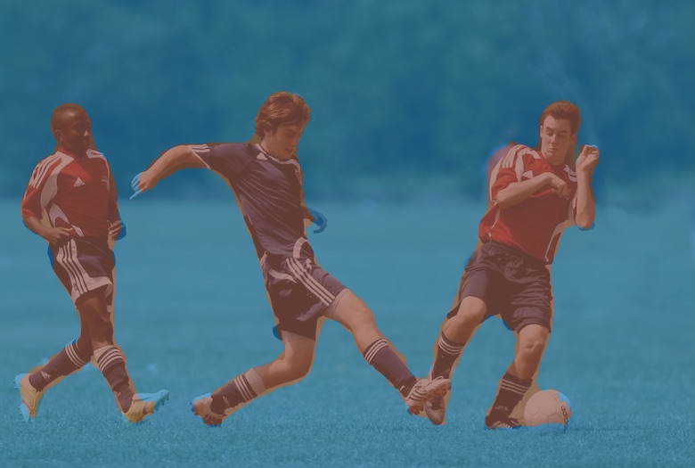

# max-vis

`max-vis` is a JavaScript library to help render the predictions returned by some of the deep learning models of the [Model Asset eXchange (MAX)](https://ibm.biz/max-models).

Given the JSON result (prediction) from one of the MAX image models and the source image, with `max-vis` you can render a new version of the image with predictions (i.e., bounding box, pose lines, etc) annotated on it.

## Install

- browser

   ```javascript
   <script src="https://cdn.jsdelivr.net/npm/@codait/max-vis"></script>
   ```

- Node.js

   ```
   npm install @codait/max-vis
   ```

## Usage

See working examples for browser and Node.js environments in the [`/examples`](https://github.com/CODAIT/max-vis/tree/master/examples) directory.

- browser

   ```javascript
   // the prediction (JSON object) returned by a MAX image model
   const prediction = ... 

   // the source image used to get the prediction
   const image = document.getElementById('myimage')

   // returns a Promise that resolves to a copy of the source image annotated with the prediction
   maxvis.annotate(prediction, image)
      .then(annotatedImageBlob => {
         // the argument passed is a Blob of a PNG image
         let img = document.createElement('img')
         img.src = URL.createObjectURL(annotatedImageBlob)
         document.body.appendChild(img)
      })
   ```

   > **Note**: _When loaded in a browser, the global variable `maxvis` will be available to access the API._

- Node.js

   ```javascript
   const maxvis = require('max-vis')

   // the prediction (JSON object) returned by a MAX image model
   const prediction = ... 

   // the source image used to get the prediction
   const image = 'images/myImage.jpg'

   // returns a Promise that resolves to a copy of the source image annotated with the prediction
   maxvis.annotate(prediction, image)
      .then(annotatedImageBuffer => {
         // the argument passed is a Buffer of a PNG image
         fs.writeFile('myAnnotatedImage.png', annotatedImageBuffer, (err) => {
            if (err) {
               console.error(err)
            }
         })
      })
   ```
   
## API

### version

Returns the `max-vis` version number

### overlay(_prediction_, _image_, _[options]_)  

Processes the prediction against the image and renders the prediction (in a `Canvas` overlay) on top of the image. Not applicable when running in Node.js.

`prediction` - (Required) the prediction output from a MAX image model  
`image` - (Required) an `HTMLImageElement` or the `id` of an `HTMLImageElement`  
`options` - (Optional) a JSON object of options to customize rendering. See [Options](#Options) for more info.  

### annotate(_prediction_, _image_, _[options]_)  

Processes the prediction against the image and creates a new version of the image that includes the rendered prediction.

`prediction` - (Required) the prediction output from a MAX image model  
`image` - (Required) an `HTMLImageElement` or `HTMLCanvasElement` or the `id` of an `HTMLImageElement` or `HTMLCanvasElement`.  
`options` - (Optional) a JSON object of options to customize rendering. See [Options](#Options) for more info.  

Returns a Promise that resolves to a `Blob` (in browsers) or `Buffer` (in Node.js) of a PNG image containing the input image annotated with the prediction.

### extract(_prediction_, _image_, _[options]_)  

Processes the prediction against the image, extracts the components from the image.

`prediction` - (Required) the prediction output from a MAX image model  
`image` - (Required) an `HTMLImageElement` or `HTMLCanvasElement` or the `id` of an `HTMLImageElement` or `HTMLCanvasElement`.  
`options` - (Optional) a JSON object of options to customize rendering. See [Options](#Options) for more info.  

Returns a Promise that resolves to an array of objects representing each item of the prediction. Each object in the array contains:

- `image`: a `Blob` (in browsers) or `Buffer` (in Node.js) of a PNG image containing the cropped out area of the input image identified in prediction.  
- `label`: a label for the image  

## Options

Available options to pass to the API. All are optional and by default, `max-vis` will try to determine the appropriate values from the prediction object.

| **Option** | **Type** | **Description** |  
|--|--|--|  
| `type` | String | The name of type of rendering the prediction applies to. Acceptable types are `boxes` (for bounding boxes), `lines` (for pose lines), or `segments` (for image segmentation). |  
| `height` | Number | The height (in pixels) of the image represented by the prediction |  
| `width` | Number | The width (in pixels) of the image represented by the prediction |  
| `colors` | 2D array | An array of RGB values to use for rendering (e.g., [[255,0,200], [125,125,125], ...]) |  
| `segments` | Array | An array of segmentation IDs to process (e.g., [0, 15]). If not provided, all segments will be processed. This is only applicable for predictions of type `segments`. |  
| `exclude` | Boolean | Set to `true` if `segments` option indicates segmentation that should be excluded instead of included in processing. Default is `false`. This is only applicable for predictions of type `segments`. |  
| `lineWidth` | Number | The thickness of the lines in the rendering. Default is 2. This is only applicable for predictions of type `boxes` or `lines`. |  

## Examples

The [`/examples`](https://github.com/CODAIT/max-vis/tree/master/examples) directory contains working examples for the browser and Node.js environments.

- **annotate bounding boxes**  


- **extract bounding boxes**  


- **annotate segmentation maps**  


- **extract segmentation maps**  


- **annotate pose lines**  


## Links

- [Model Asset eXchange (MAX)](https://ibm.biz/max-models)
- [Pre-trained Model Asset eXchange (MAX) models for TensorFlow.js](https://github.com/CODAIT/max-tfjs-models)
- Sample image: [jockey.jpg](https://www.pexels.com/photo/action-athlete-competition-course-158976/)
- Sample image: [pilots](https://en.wikipedia.org/wiki/Apollo_11#/media/File:Apollo_11_Crew.jpg)
- Sample image: [soccer.jpg](https://www.pexels.com/photo/action-athletes-ball-blur-274422/)

## License

[Apache-2.0](LICENSE)
